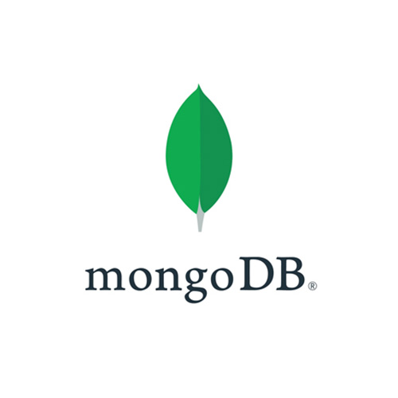

<h3>Hi there, I'm Manoj Manoharan</h3>
<H4>Passionate Full Stack Developer, skilled in crafting end-to-end solutions with a focus on innovation and user-centric design.</H4>

  
   
  
  

 
<h3 align="center">Technologies & Tools</h3>
<table align="center" border="0">
 <tr>
    <!-- <td><b style="font-size:30px"></b></td> -->
    <td><b style="font-size:30px">ReactJs</b></td>
    <td><b style="font-size:30px">NodeJs</b></td>
    <td><b style="font-size:30px">ExpressJs</b></td>
    <td><b style="font-size:30px">BunJs</b></td>
    <td><b style="font-size:30px">MongoDB</b></td>
    <td><b style="font-size:30px">MySQL</b></td>
 </tr>
 <tr>
    <td>
    
    </td>
    <td>
     
    </td>
    <td>
     
    </td>
    <td>
     
    </td>
    <td>
     
    </td>
    <td>
     
    </td>
    
 </tr>
</table>

<table align="center" border="0">
 <tr>
    <td><b style="font-size:30px"></b></td>
    <td><b style="font-size:30px">Repositories</b></td>
 </tr>
 <tr>
    <td>
<picture>
  <source
    srcset="https://github-readme-stats.vercel.app/api?username=manojconcept&show_icons=true&theme=dark"
    media="(prefers-color-scheme: dark)"
  />
  <source
    srcset="https://github-readme-stats.vercel.app/api?username=manojconcept&show_icons=true"
    media="(prefers-color-scheme: light), (prefers-color-scheme: no-preference)"
  />
  
</picture></td>
    <td>
    
    </td>
 </tr>
</table>

<!--
**manojconcept/manojconcept** is a ✨ _special_ ✨ repository because its `README.md` (this file) appears on your GitHub profile.

Here are some ideas to get you started:

- 🔭 I’m currently working on ...
- 🌱 I’m currently learning ...
- 👯 I’m looking to collaborate on ...
- 🤔 I’m looking for help with ...
- 💬 Ask me about ...
- 📫 How to reach me: ...
- 😄 Pronouns: ...
- ⚡ Fun fact: ...
-->
